  

  

 

  

  
  
  

 

  
  
  

---

<h2 align="center">🛠️ Technical Arsenal</h2>

  

  

---

<h2 align="center">💻 Simulation Systems</h2>

  

| Project | What it solves | Stack |
|---|---|---|
| [**TurfSync**](https://github.com/fairuzfaiyaz/TurfSyncTurfSchedulingSportsSystem) | Conflict-free sports turf slot scheduling | C++, constraints, scheduling logic |
| [**Embassy Line Sim**](https://github.com/fairuzfaiyaz/Embassy-Consulate-Line-System) | Queue simulation to surface visa service bottlenecks | C++, queue models, runtime metrics |
| [**Hospital Resource Sim**](https://github.com/fairuzfaiyaz/Hospital-Resource-Management-Simulation) | Dynamic triage and doctor allocation under pressure | C++, priority queues, event logic |
| [**UniTracker**](https://github.com/fairuzfaiyaz/UNIVERSITY-INFORMATION-PERFORMANCE-TRACKING-SYSTEM) | Persistent academic records with custom storage | C++, file I/O, data tracking |

---

<h2 align="center">🎓 Academic Journey</h2>

  

---

<h2 align="center">📊 Live Activity</h2>

  

  
  

---

  

  

